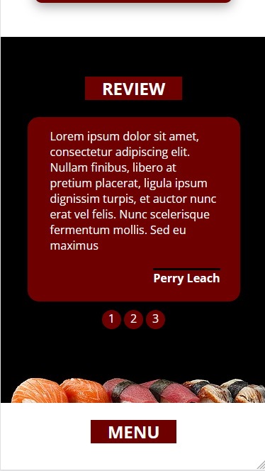
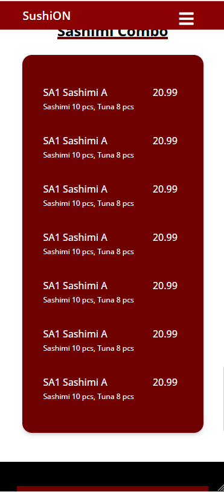
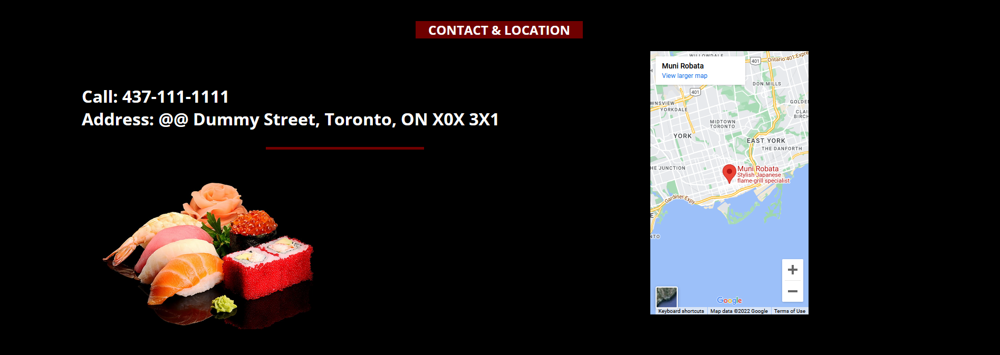

# SushiON-A responsive sushi restaurant landing page

# Languages: HTML, CSS, Javascript

# Showcase:

### Landing Section

#### Desktop

#### Phone

### Review Section

#### Desktop

#### Phone

### Review Section

#### Desktop

#### Phone

### Menu Section

#### Desktop

#### Phone

### Location Section

#### Desktop

#### Phone

